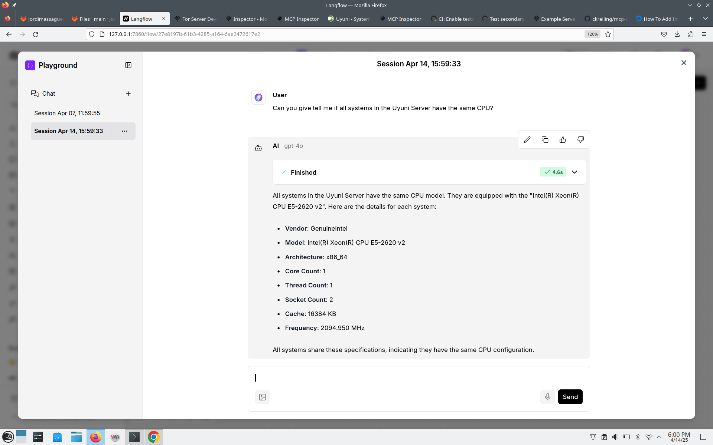
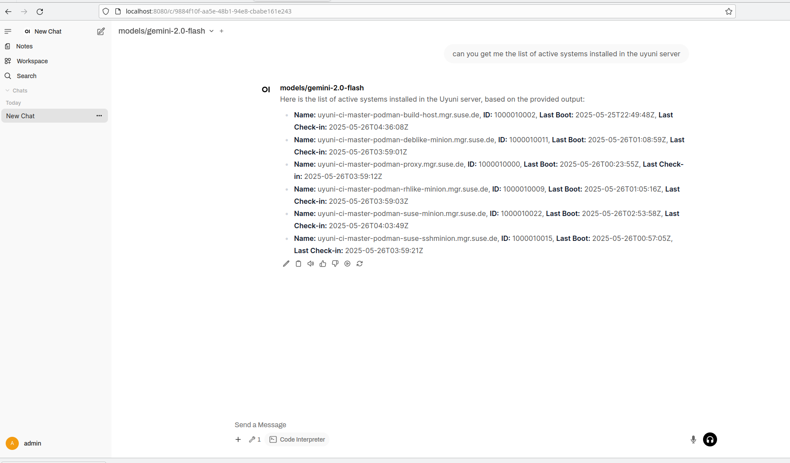
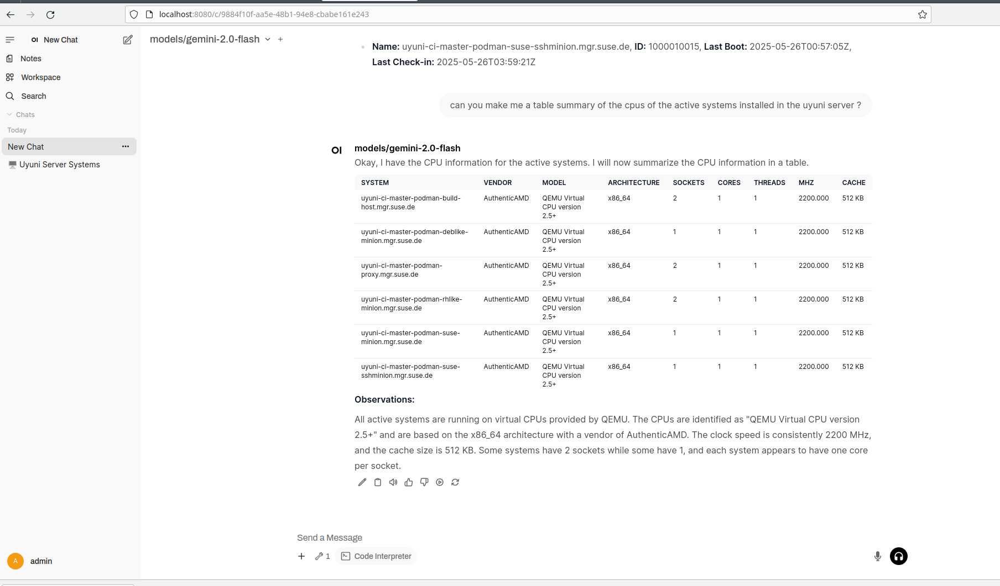

# mcp-server-uyuni

Model Context Protocol Server for Uyuni Server API.

## Tools

* get_list_of_active_systems
* get_cpu_of_a_system
* get_all_systems_cpu_info
* check_system_updates
* check_all_systems_for_updates

## Usage

You need `uv` installed. See https://docs.astral.sh/uv

Once you have `uv`, install the dependencies with:

`uv sync`

You need to create the `.venv/credentials` with a content like this:

```
UYUNI_SERVER=192.168.1.124:8443
UYUNI_USER=admin
UYUNI_PASS=admin
```

Replace the values by the ones that make sense for you.

Then, you can use this command with an `mcp-client`:

`uv run --env-file=.venv/credentials --directory PATH OF THIS CHECKOUT mcp-server-uyuni.py`

## Debug with mcp inspect

You can run

`npx @modelcontextprotocol/inspector uv run --env-file=.venv/credentials --directory PATH OF THIS CHECKOUT mcp-server-uyuni.py`

## Use with langflow

You can add an `MCP Server tool` and set the `MCP Command` to:

`uv run --env-file=.venv/credentials --directory PATH OF THIS CHECKOUT mcp-server-uyuni.py`




## Use with Open WebUI

Open WebUI is an extensible, feature-rich, and user-friendly self-hosted AI platform designed to operate entirely offline. It supports various LLM runners like Ollama and OpenAI-compatible APIs, with built-in inference engine for RAG, making it a powerful AI deployment solution. More at https://docs.openwebui.com/

### Setup Open WebUI

You need `uv` installed. See https://docs.astral.sh/uv

Start v0.6.10 (for MCP support we need a version >= 0.6.7)

```
 uv tool run open-webui@0.6.10 serve
```

Configure the OpenAI API URL by following these instructions:

https://docs.openwebui.com/getting-started/quick-start/starting-with-openai

For gemini, use the URL https://generativelanguage.googleapis.com/v1beta/openai/ and get the token API from the Google AI Studio https://aistudio.google.com/

### Setup Open WebUI MCP Support

You need to create the `.venv/credentials` with a content like this:

```
UYUNI_SERVER=192.168.1.124:8443
UYUNI_USER=admin
UYUNI_PASS=admin
```

Then, you need a `config.json` with a content like this. Replace the values by the ones that make sense for you.

```
{
  "mcpServers": {
    "mcp-server-uyuni": {
      "command": "uv",
      "args": ["run", "--env-file=PATH OF THIS CHECKOUT/.venv/credentials","--directory","PATH OF THIS CHECKOUT","mcp-server-uyuni.py"]
    }
  }
}
```

Then, you can start the Model Context Protocol to Open API proxy server:

```
uvx mcpo --port 9000  --config ./config.json
```

## Add the tool

And then you can add the tool to the Open Web UI. See https://docs.openwebui.com/openapi-servers/open-webui#step-2-connect-tool-server-in-open-webui .  

Note the url should be http://localhost/mcp-server-uyuni as explained in https://docs.openwebui.com/openapi-servers/open-webui#-optional-using-a-config-file-with-mcpo






## License

MIT

