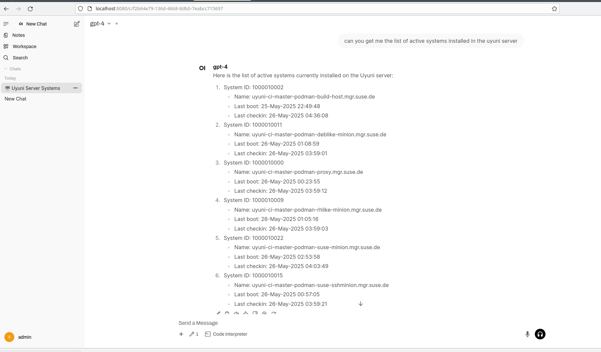

# mcp-server-uyuni

Model Context Protocol Server for Uyuni Server API.

## Tools

* get_list_of_active_systems
* get_cpu_of_a_system
* get_all_systems_cpu_info
* check_system_updates
* check_all_systems_for_updates
* schedule_apply_pending_updates_to_system
* get_systems_needing_security_update_for_cve
* get_systems_needing_reboot
* schedule_system_reboot

## Usage

You need `uv` installed. See https://docs.astral.sh/uv

Once you have `uv`, install the dependencies with:

`uv sync`

You need to create the `.venv/credentials` with a content like this:

```
UYUNI_SERVER=192.168.1.124:8443
UYUNI_USER=admin
UYUNI_PASS=admin
```

Replace the values by the ones that make sense for you.

Then, you can use this command with an `mcp-client`:

`uv run --env-file=.venv/credentials --directory PATH OF THIS CHECKOUT mcp-server-uyuni.py`

## Debug with mcp inspect

You can run

`npx @modelcontextprotocol/inspector uv run --env-file=.venv/credentials --directory PATH OF THIS CHECKOUT mcp-server-uyuni.py`

## Use with langflow

You can add an `MCP Server tool` and set the `MCP Command` to:

`uv run --env-file=.venv/credentials --directory PATH OF THIS CHECKOUT mcp-server-uyuni.py`


## Use with Open WebUI

Open WebUI is an extensible, feature-rich, and user-friendly self-hosted AI platform designed to operate entirely offline. It supports various LLM runners like Ollama and OpenAI-compatible APIs, with built-in inference engine for RAG, making it a powerful AI deployment solution. More at https://docs.openwebui.com/

### Setup Open WebUI

You need `uv` installed. See https://docs.astral.sh/uv

Start v0.6.10 (for MCP support we need a version >= 0.6.7)

```
 uv tool run open-webui@0.6.10 serve
```

Configure the OpenAI API URL by following these instructions:

https://docs.openwebui.com/getting-started/quick-start/starting-with-openai

For gemini, use the URL https://generativelanguage.googleapis.com/v1beta/openai and get the token API from the Google AI Studio https://aistudio.google.com/

### Setup Open WebUI MCP Support

You need to create the `.venv/credentials` with a content like this:

```
UYUNI_SERVER=192.168.1.124:8443
UYUNI_USER=admin
UYUNI_PASS=admin
```

Then, you need a `config.json` with a content like this. Replace the values by the ones that make sense for you.

```
{
  "mcpServers": {
    "mcp-server-uyuni": {
      "command": "uv",
      "args": ["run", "--env-file=PATH OF THIS CHECKOUT/.venv/credentials","--directory","PATH OF THIS CHECKOUT","mcp-server-uyuni.py"]
    }
  }
}
```

Then, you can start the Model Context Protocol to Open API proxy server:

```
uvx mcpo --port 9000  --config ./config.json
```

## Add the tool

And then you can add the tool to the Open Web UI. See https://docs.openwebui.com/openapi-servers/open-webui#step-2-connect-tool-server-in-open-webui .  

Note the url should be http://localhost/mcp-server-uyuni as explained in https://docs.openwebui.com/openapi-servers/open-webui#-optional-using-a-config-file-with-mcpo





## Release Process

To create a new release for `mcp-server-uyuni`, follow these steps:

1.  **Update Documentation (`README.md`):**
    *   Ensure the list of available tools under the "## Tools" section is current and reflects all implemented tools in `mcp-server-uyuni.py`.
    *   Review and update any screenshots in the `docs/` directory and their references in this `README.md` to reflect the latest UI or functionality, if necessary.
    *   Verify all usage instructions and examples are still accurate.
2.  **Update Manual Test Cases (`TEST_CASES.md`):**
    *   Refer to the "How to Update for a New Tag/Release" section within `TEST_CASES.md`.
    *   Add a new status column for the upcoming release version (e.g., `Status (vX.Y.Z)`).
    *   Execute all relevant manual test cases against the code to be released.
    *   Record the `Pass`, `Fail`, `Blocked`, or `N/A` status for each test case in the new version column.
3.  **Commit Changes:** Commit all the updates to `README.md`, `TEST_CASES.md`, and any other changed files.
4. **Update version in pyproject.toml:** Use semantic versioning to set the new version.
5.  **Update CHANGELOG.md:**
    *   Generate the changelog using `conventional-changelog-cli`. If you don't have it installed globally, you can use `npx`.
    *   The command to generate the changelog using the `conventionalcommits` preset and output it to `CHANGELOG.md` (prepending the new changes) is:
        ```bash
        npx conventional-changelog-cli -p conventionalcommits -i CHANGELOG.md -s
        ```
    *   Review the generated `CHANGELOG.md` for accuracy and formatting.
    *   Commit the updated `CHANGELOG.md`.
6.  **Create Git Tag:** Create a new Git tag for the release (e.g., `git tag vX.Y.Z`). Follow [semantic versioning rules](https://semver.org/).
7.  **Push Changes and Tags:** Push your commits (including the changelog update) and the new tag to the repository (e.g., `git push && git push --tags`).


## License

MIT
