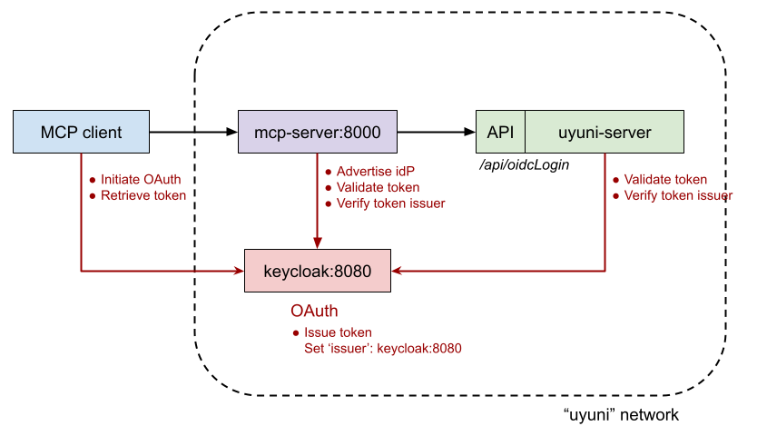

# MCP + Keycloak Test Deployment

This guide deploys the MCP server and Keycloak next to an existing Uyuni deployment.



**This deployment is intended only for dev/test environments.**

Assumptions:
- Uyuni is already running on a Podman network named `uyuni`.
- Uyuni is reachable in that network as `uyuni-server`.

## Quick start

1. Create the environment file:

```bash
cp deploy/stack.env.example deploy/stack.env
```

2. Edit `deploy/stack.env` and set:
- `UYUNI_MCP_PUBLIC_URL`
- `KEYCLOAK_BOOTSTRAP_ADMIN_PASSWORD`

For most setups, leave everything else at defaults.

3. Start services:

```bash
docker compose --env-file deploy/stack.env up -d --build
docker compose --env-file deploy/stack.env ps
```

4. Verify endpoints:

```bash
curl -sS http://<mcp-host>:<MCP_BIND_PORT>/.well-known/oauth-protected-resource | jq
curl -sS http://<mcp-host>:<MCP_BIND_PORT>/mcp
```

## Graphical Environment & Authentication
The OAuth2 Authorization Code flow requires a **user interaction step** (logging in and clicking 'Authorize'). 

> [!WARNING]
> **Headless Environments:** If you are running on a server without a GUI, the authentication will fail or timeout because the client cannot open a browser to show you the Keycloak login page.

**Requirements:**
- **Firefox:** Must be installed on the host.
- **Display:** You must have access to a graphical session (KDE, GNOME, or VNC) to interact with the authentication prompts.

## Static vs. Dynamic Registration
This stack is pre-configured for **Static Client Registration**. 

Dynamic registration allows any unknown client to register itself. Static registration ensures only the clients defined in your Keycloak JSON (like `mcp-server-uyuni`) are permitted to request tokens.

Our setup uses specific scopes (`mcp:read`, `mcp:write`). Generic clients often request `basic` or `profile` by default, which Keycloak will reject unless they are explicitly mapped to a static client.

### Example: Gemini CLI Configuration
To use the Gemini CLI with this stack, use a static configuration in your `mcp_config.json`:

```json
{
  "mcpServers": {
    "mcp-server-uyuni": {
      "httpUrl": "http://<mcp-host>:<MCP_BIND_PORT>/mcp",
      "oauth": {
        "enabled": true,
        "clientId": "mcp-server-uyuni",
        "authUrl": "http://keycloak:8080/realms/uyuni-mcp/protocol/openid-connect/auth",
        "tokenUrl": "http://keycloak:8080/realms/uyuni-mcp/protocol/openid-connect/token",
        "scopes": ["mcp:read", "mcp:write", "offline_access"]
      }
    }
  }
}
```

## Running against a remote Podman host

If compose runs from your local machine but containers run remotely:

```bash
ssh -fnNT -L /tmp/remote-podman.sock:/run/podman/podman.sock <user>@<remote-host>
export DOCKER_HOST="unix:///tmp/remote-podman.sock"
docker info
```

Cleanup when finished with deployment:

```bash
unset DOCKER_HOST
pkill -f "ssh -fnNT -L /tmp/remote-podman.sock"
rm -f /tmp/remote-podman.sock
```

## Client access from your local machine

If your MCP client runs on your host and follows discovery metadata, the Keycloak hostname must resolve on your host too.

Typical approach:

1. Map Keycloak locally to the remote server IP:

```bash
echo "<remote-server-ip> keycloak" | sudo tee -a /etc/hosts
```

2. Keep these values in `deploy/stack.env`:
- `KEYCLOAK_PUBLIC_HOSTNAME=keycloak`
- `KEYCLOAK_PUBLIC_PORT=8080`
- `UYUNI_AUTH_SERVER=http://keycloak:8080/realms/uyuni-mcp`

3. Configure your client to use the remote MCP URL (for example `http://<remote-server-ip>:8000/mcp`).

## OIDC settings that must align

These must represent the same issuer URL:
- `UYUNI_AUTH_SERVER` in `deploy/stack.env`
- `web.oidc.idp.issuer` in Uyuni `rhn.conf`
- Issuer advertised by Keycloak (`KEYCLOAK_PUBLIC_HOSTNAME` + `KEYCLOAK_PUBLIC_PORT`)

If one differs, token validation fails.

## Uyuni integration

Create a Uyuni user that matches a Keycloak user (example):

```bash
spacecmd user_create -- -u mcp-tester -p mcp-tester-pass -e mcp-tester@localhost -f MCP -l Tester
spacecmd user_addrole mcp-tester org_admin
```

Set Uyuni OIDC config (`/etc/rhn/rhn.conf`):

```toml
web.oidc.enabled = true
web.oidc.idp.issuer = <same value as UYUNI_AUTH_SERVER>
```

Restart Uyuni web service:

```bash
systemctl restart tomcat
```

- `HTTP Status 404` during startup:

If Tomcat fails to start or returns 404s, it may be failing to fetch the OIDC discovery document.
Check Proxy Settings: If server.satellite.http_proxy is set in rhn.conf, you must add keycloak to the no_proxy list:

```plaintext

server.satellite.no_proxy = keycloak, <keycloak-ipv4>, <keycloak-ipv6>
```

Restart Tomcat after changing: systemctl restart tomcat

## Automation-friendly flow

For non-interactive runs, keep changes minimal:

1. Prepare env file with stable values.
2. Start stack.
3. Run smoke checks.
4. Collect logs and stop.

Example:

```bash
docker compose --env-file deploy/stack.env up -d --build
curl -fsS http://<mcp-host>:<MCP_BIND_PORT>/.well-known/oauth-protected-resource >/dev/null
docker compose --env-file deploy/stack.env logs --no-color mcp-server keycloak | tail -n 200
docker compose --env-file deploy/stack.env down -v
```

Recommended safety default for automated runs:
- `UYUNI_MCP_WRITE_TOOLS_ENABLED=false`

## Public endpoint deployments

When using load balancers, DNS names, or tunnels, set public URIs explicitly and keep issuer alignment intact.

Use this checklist:
- `UYUNI_MCP_PUBLIC_URL` points to the public MCP base URL.
- `KEYCLOAK_PUBLIC_HOSTNAME` and `KEYCLOAK_PUBLIC_PORT` match the public Keycloak endpoint.
- `UYUNI_AUTH_SERVER` uses the same public Keycloak issuer URL.
- Uyuni `web.oidc.idp.issuer` equals `UYUNI_AUTH_SERVER`.

### Optional: DCR-sanitizing Keycloak proxy for Amazon Quick

This compose stack includes an optional lightweight `nginx` proxy (`keycloak-dcr-proxy`) that forwards all Keycloak traffic and sanitizes dynamic client registration (`POST /realms/uyuni-mcp/clients-registrations/openid-connect`) by removing a `registration_url` field from the JSON body before it reaches Keycloak.

Use it when your client sends non-Keycloak DCR metadata and Keycloak rejects it.

- The proxy is behind compose profile `dcr-proxy` (not started by default).
- Start with profile enabled:
  ```bash
  docker compose --env-file deploy/stack.env --profile dcr-proxy up -d --build
  ```
- Proxy bind port: `KEYCLOAK_DCR_PROXY_BIND_PORT` (default `8081`)
- Route your external tunnel/client to this proxy endpoint instead of Keycloak directly.
- Keep `UYUNI_AUTH_SERVER`/Uyuni issuer alignment unchanged unless you intentionally move the issuer host to the proxy host.

## Troubleshooting

- `network uyuni not found`:
  Create/verify the external `uyuni` network on the Podman host.
- Issuer mismatch errors:
  Re-check all issuer values in the alignment section.
- MCP cannot reach Uyuni:
  Confirm `UYUNI_SERVER=uyuni-server` and shared `uyuni` network.
- Watch service logs during auth and tool calls:

```bash
docker compose --env-file deploy/stack.env logs -f mcp-server keycloak
```

- For Uyuni auth-side errors:

```bash
tail -f /var/log/rhn/rhn_web_ui.log
```

## Cleanup

```bash
docker compose --env-file deploy/stack.env down -v
```
