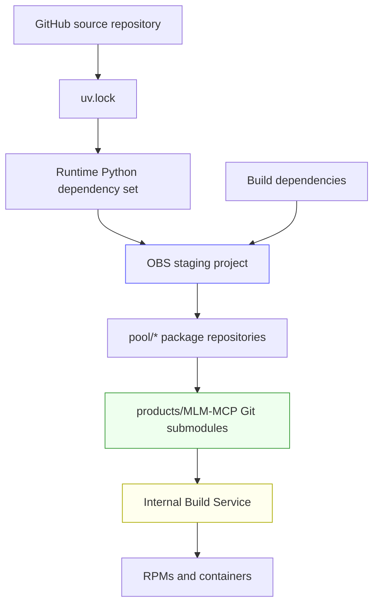
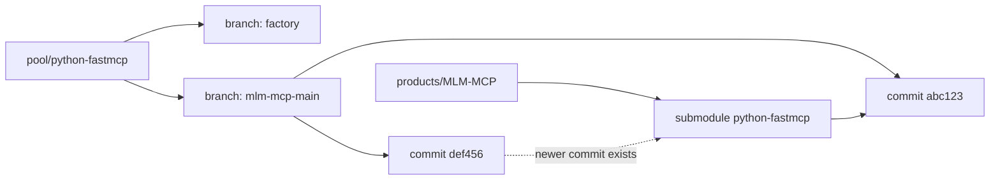
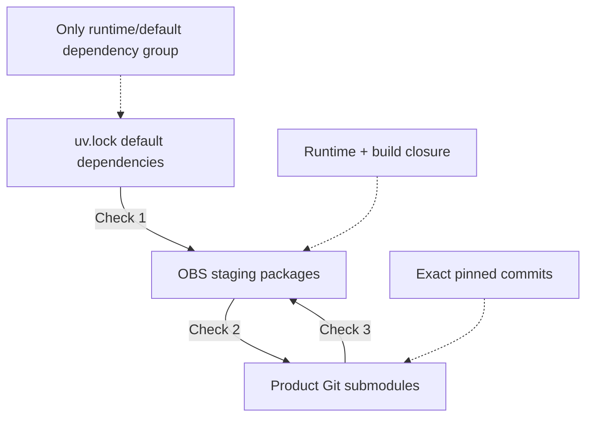
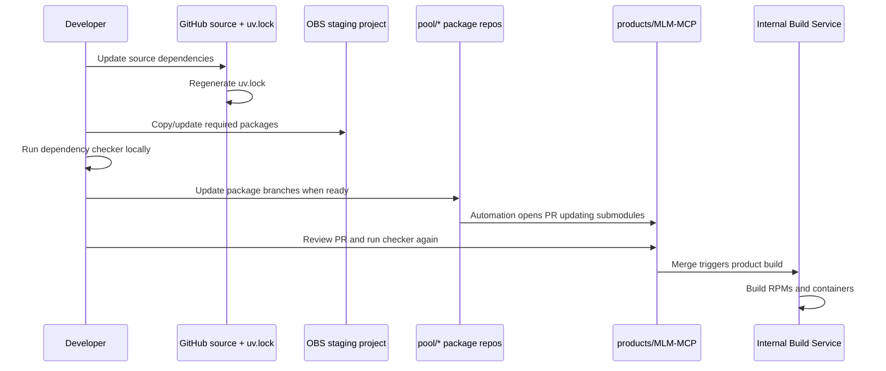
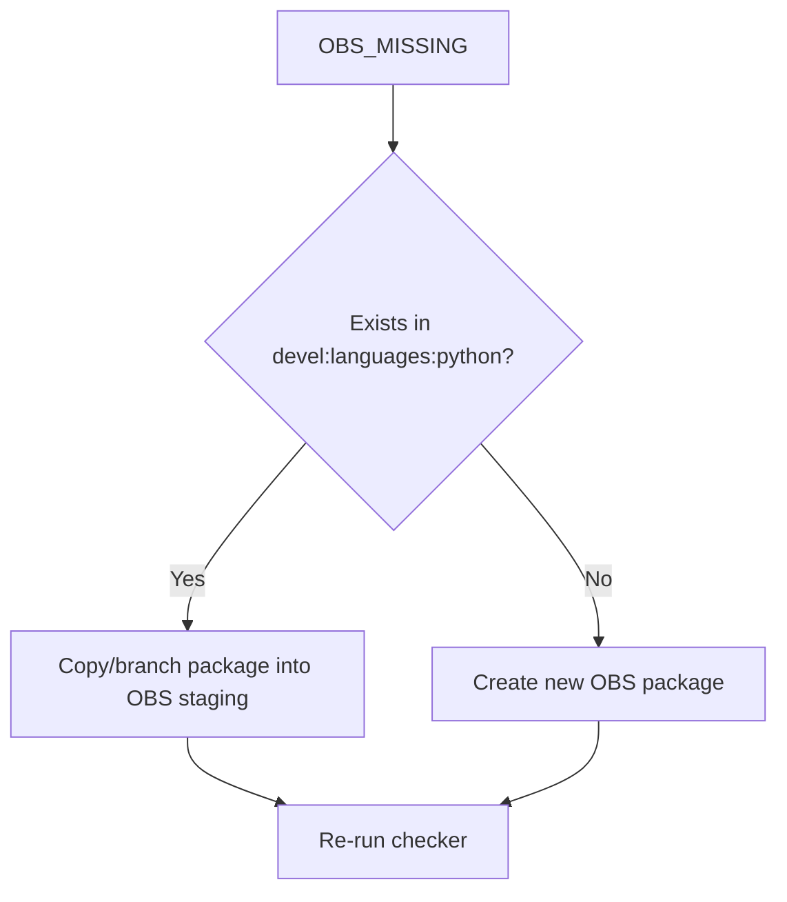
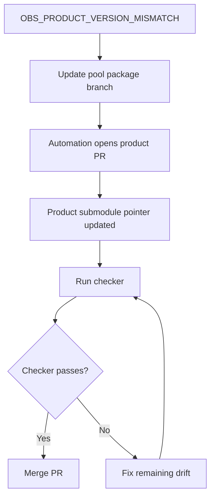

# Dependency Synchronization Checker

This document explains the dependency synchronization model used to keep the **MLM-MCP product** aligned with its Python source dependencies, the OBS staging project, and the internal product build pipeline.

The goal is to make the dependency promotion flow explicit, auditable, and repeatable.

---

## Why this exists

The source project uses modern Python dependencies declared and locked through `uv.lock`. However, the product is not built directly from Python wheels or PyPI. For supply-chain traceability, security, and reproducibility, dependencies are packaged as RPMs and built through the Open Build Service ecosystem.

The product is then assembled in Gitea using Git submodules that point to exact commits of package repositories.

This gives us traceability, but it also creates several synchronization points that can drift.



The important idea is:

```text
uv.lock → OBS staging project (+ build dependencies) → product Git submodules
```

---

## Conceptual model

### `uv.lock`

`uv.lock` represents the desired Python dependency state from the source project.

For this checker, only the **default dependency group** is relevant. Development, testing, documentation, linting, or benchmark dependencies should not be treated as runtime product dependencies.

Examples of dependencies that should usually be excluded from the runtime check:

- `pytest`
- `pytest-xdist`
- `respx`
- `deepeval`
- documentation-only packages
- linting/type-checking tools

### OBS staging project

The OBS staging project is the controlled snapshot used to validate the full dependency closure required to build the product.

It contains:

- runtime dependencies from the default `uv.lock` dependency graph;
- build dependencies required to package those runtime dependencies as RPMs;
- packaging tools such as `hatchling`, `poetry-core`, `maturin`, `trove-classifiers`, etc.;
- additional dependencies needed to build containers or RPM artifacts.

The OBS staging project is therefore larger than the default `uv.lock` dependency graph.

### Product Git submodules

The product repository, `products/MLM-MCP`, includes package repositories as Git submodules.

Each submodule points to one exact commit. It does **not** automatically follow the latest commit of a branch.



Even if `pool/python-fastmcp` is updated, the product keeps using the old commit until the submodule pointer is updated and committed in the product repository.

---

## What the checker validates

The checker validates three boundaries.



### Check 1: `uv.lock` → OBS staging

Question:

> Are all default runtime dependencies from `uv.lock` present in the OBS staging project with the expected version?

Possible statuses:

| Status | Meaning | Typical action |
|---|---|---|
| `OK` | Dependency exists in OBS with the same version | Nothing |
| `OBS_MISSING` | Dependency exists in `uv.lock` but not in OBS | Add/copy package into OBS staging |
| `OBS_OLDER_THAN_UV_LOCK` | OBS has an older version | Update OBS package, usually from `devel:languages:python` |
| `OBS_NEWER_THAN_UV_LOCK` | OBS has a newer version | Consider updating `uv.lock` |

### Check 2: OBS staging → Product submodules

Question:

> Does every package in the OBS staging project exist as a product submodule, and does the submodule point to the same version?

Possible statuses:

| Status | Meaning | Typical action |
|---|---|---|
| `OK` | OBS package and product submodule match | Nothing |
| `PRODUCT_SUBMODULE_MISSING` | OBS package is not included as a product submodule | Add the submodule if required by the build closure |
| `OBS_PRODUCT_VERSION_MISMATCH` | Product submodule points to a different version | Update the submodule pointer |
| `UNKNOWN_PRODUCT_VERSION` | Version could not be read or contains macros | Inspect package manually |

### Check 3: Product submodules not present in OBS

Question:

> Are there product submodules that are no longer represented in the OBS staging project?

Possible statuses:

| Status | Meaning | Typical action |
|---|---|---|
| `PRODUCT_ORPHAN_SUBMODULE` | Product contains a submodule not found in OBS | Remove submodule or add corresponding OBS package |

Some exceptions may be expected, for example container-only repositories that contain a `Dockerfile` instead of an RPM `.spec` file.

---

## Why this is intentionally strict

The rule is:

> Every package in the OBS staging project must have a corresponding product submodule.

This makes the OBS staging project the explicit build closure for the product.

That means missing product submodules are not ignored by default. They either indicate:

1. a real product synchronization issue;
2. a package that should be added as a product submodule;
3. an intentional exception that should be documented or excluded explicitly.

---

## Typical promotion flow



Important: updating a package branch in `pool/*` does **not** update the product by itself. The product changes only when the submodule pointer is updated and committed in `products/MLM-MCP`.

---

## Local validation workflow

Clone the product repository and initialize submodules:

```bash
git clone <product-repo-url> MLM-MCP
cd MLM-MCP
git submodule update --init --recursive
```

Run the checker:

```bash
python dependency_sync_check.py systemsmanagement:Uyuni:AI \
  --uv-lock /path/to/uv.lock \
  --product-repo /path/to/MLM-MCP
```

If a submodule is not initialized, the checker should fail fast with a clear message. Container-only submodules may be allowed if they contain a `Dockerfile` instead of a `.spec` file.

---

## Testing submodule updates locally

You can test a product submodule update locally without changing the remote product repository.

Example:

```bash
cd MLM-MCP
cd python-fastmcp
git fetch origin
git checkout origin/mlm-mcp-main
cd ..
```

Now check the product repository status:

```bash
git status
git diff --submodule
```

You should see something like:

```text
modified: python-fastmcp (new commits)
```

Run the checker again. If the mismatch disappears, the submodule pointer update is correct.

Nothing changes remotely until you commit and push the product repository:

```bash
git add python-fastmcp
git commit -m "Update python-fastmcp submodule"
git push
```

To discard local submodule experiments:

```bash
git submodule update --init --recursive
```

---

## How to fix synchronization issues

### Case 1: `OBS_MISSING`

Example:

```text
httpx | Status: OBS_MISSING | uv.lock: 0.28.1 | OBS: [Missing]
```

Meaning:

`uv.lock` requires the package, but OBS staging does not contain it.

Resolution:

1. Check whether the package exists in `devel:languages:python` or a related OBS project.
2. If it exists, copy or branch it into the OBS staging project.
3. If it does not exist, create the package in OBS.
4. Re-run the checker.



### Case 2: OBS is newer than `uv.lock`

Meaning:

The staging project already contains a newer version than the one locked by the source project.

Resolution:

1. Evaluate whether the newer version is acceptable.
2. Update the source dependency and regenerate `uv.lock`.
3. Re-run tests.
4. Re-run the checker.

### Case 3: OBS is older than `uv.lock`

Meaning:

The source project expects a newer dependency than the one staged in OBS.

Resolution:

1. Check whether the newer version exists in `devel:languages:python`.
2. If yes, copy/update it into OBS staging.
3. If no, update the package in `devel:languages:python` or create the update manually.
4. Re-run the checker.

### Case 4: `OBS_PRODUCT_VERSION_MISMATCH`

Example:

```text
python-anyio | OBS: 4.13.0 | Product: 4.11.0
```

Meaning:

OBS staging has the desired package version, but the product submodule still points to an older or different commit.

Resolution:

1. Update the corresponding package branch, such as `mlm-mcp-main`, from Factory or the desired source commit.
2. Let automation create the product PR, or update the submodule pointer manually.
3. Run the checker against the PR.
4. Merge only when the checker passes.



### Case 5: `PRODUCT_SUBMODULE_MISSING`

Meaning:

OBS staging contains a package, but the product does not include it as a submodule.

Resolution:

1. Confirm whether the package is part of the required product build closure.
2. If yes, add it as a submodule to `products/MLM-MCP`.
3. If no, remove it from OBS staging or mark it as an explicit exception.
4. Re-run the checker.

### Case 6: `PRODUCT_ORPHAN_SUBMODULE`

Meaning:

The product contains a submodule that is not present in OBS staging.

Resolution:

1. If the submodule is still needed, add the corresponding package to OBS staging.
2. If the submodule is obsolete, remove it from the product.
3. If it is a valid non-RPM artifact, such as a container repository, document it as an exception.

---

## Known exceptions

Some product submodules may not contain an RPM `.spec` file. For example, a container-only module may contain a `Dockerfile` instead.

These should be handled explicitly instead of treated as normal Python/RPM packages.

Example:

```text
mcp-server-mlm-image
```

Recommended policy:

- allow submodules with a `Dockerfile` during initialization validation;
- exclude them from RPM version comparisons;
- document them as product-level artifacts.

---

## Recommended report interpretation

A good checker report should be read in this order:

1. **Fix `uv.lock → OBS` issues first.**  
   These indicate missing or mismatched runtime dependencies.

2. **Fix `OBS → product` version mismatches next.**  
   These usually require updating product submodule pointers.

3. **Review missing product submodules.**  
   These may indicate incomplete product build closure.

4. **Review orphan product submodules last.**  
   These may be obsolete packages or intentional exceptions.

---

## Summary

This process is complex because it bridges two worlds:

- fast-moving Python dependency management through `uv.lock`;
- controlled, traceable, reproducible product builds through RPMs, OBS, Gitea package repositories, and product submodules.

The checker exists to make this complexity visible and manageable.

The intended invariant is:

```text
Default runtime dependencies in uv.lock
    ⊆ OBS staging project
    == product submodule build closure
```

When the invariant fails, the checker should show exactly which layer is out of sync and what action should be taken next.

